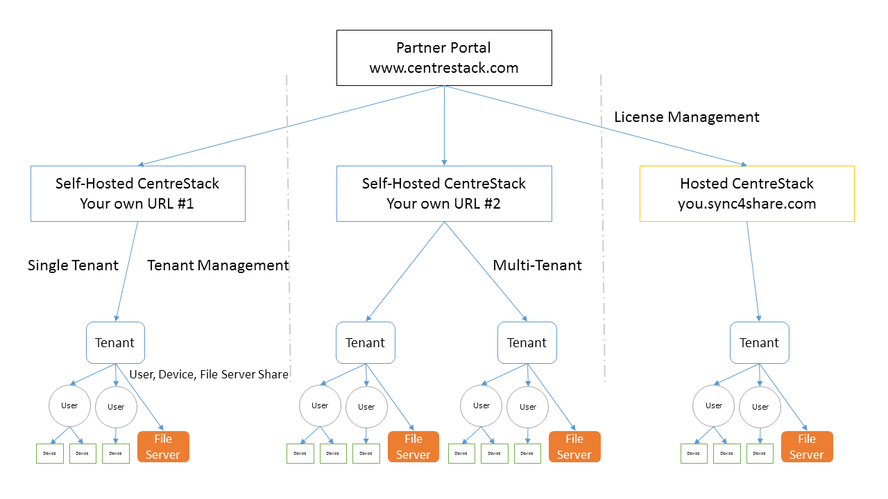

Administration Scope
====================

Management Overview
-------------------

CentreStack provides a unified management portal for all of the objects associated with your file‑sharing environment. At the highest level you manage a **cluster** (sometimes called a server farm), which may consist of a single server or a scalable pool of servers. Within that cluster you create one or more **tenants** – isolated workspaces representing your organisation or a client’s organisation. Each tenant contains its own users, groups, devices, storage connectors (Team Folders) and policies.

A simplified breakdown of the management objects is shown below:

* **Cluster** – the server farm and its global configuration (branding, SMTP, database connections, worker nodes and licences).
* **Tenant** – an isolated business unit or customer with its own users, groups, storage quotas, policies and branding.
* **Users** – individual accounts within a tenant; they can be regular users, guest users or tenant administrators.
* **Groups** – collections of users that simplify permission management.
* **Team Folders / Shared Workspaces** – published file server shares or cloud storage locations that users collaborate on.
* **Devices** – registered desktops, laptops and mobile devices used by users to access their data.
* **Policies** – security settings (two‑factor authentication, data leak protection, ransomware protection, file locking, etc.) and quotas applied at cluster or tenant level.

Partner Portal and Licensing
----------------------------

Licence management is performed through the **Partner Portal** (<https://partner.centrestack.com>). From the partner portal you download the CentreStack software, allocate licences to your clusters and assign them to tenants. In a typical deployment you install CentreStack with a 30‑day trial licence; once configuration is complete you return to the partner portal to allocate permanent licences and activate your production servers.

Self‑Hosted vs Hosted
---------------------

This guide focuses on **Self‑Hosted CentreStack**, where you operate your own server (or servers) on‑premises or in a public cloud. Hosted CentreStack (also called **sync4share**) is a multi‑tenant service operated by Gladinet where you administer tenants but not the underlying cluster. For hosted deployments refer to the *Hosted CentreStack Administration Guide*.

Tenants
-------

A *tenant* is the main unit of administration and billing. You can deploy a single‑tenant cluster for your own organisation, or create multiple tenants to serve multiple customers or departments. Each tenant encapsulates a user directory, team folders, policies, quotas and branding. Tenants map naturally to companies or customers in a managed‑service‑provider (MSP) scenario.

Users, Groups and Devices
-------------------------

Within a tenant you manage **users**, **groups** and **devices**:

- **Users** can be native accounts or imported from Active Directory or Azure AD.
- **Groups** represent collections of users that can be assigned to team folders and policies.
- **Devices** are the desktops, laptops and mobile devices registered by users. Administrators can see which devices are connected and enforce policies (for example, limiting the number of concurrent devices).

File Server Shares and Team Folders
-----------------------------------

Team Folders are the shared workspaces where users collaborate. Each team folder is typically backed by a Windows file share, a Network Attached Storage (NAS) share or a cloud storage bucket. When you publish a file share as a team folder you can choose to inherit existing NTFS permissions or define new permissions. Users access team folders through mapped drives, the web portal or mobile apps, with real‑time synchronisation and optional offline caching.

Cluster vs Tenant Administrators
--------------------------------

There are two scopes of administration:

* **Cluster Administrator** – manages cluster‑wide services such as SMTP, database settings, worker nodes, cluster branding and default policies. The cluster administrator can create tenants and acts as the tenant administrator for the first (default) tenant. In many cases a single server is sufficient for an organisation’s needs.

* **Tenant Administrator** – manages a specific tenant: creating users and groups, publishing team folders, configuring SAML/MFA/DLP policies, branding the tenant portal and monitoring usage. In a multi‑tenant environment each tenant has its own administrator; cluster administrators can assist tenant administrators if needed.

Tips and Notes
--------------

* All administration tasks are performed via the CentreStack web portal. We recommend using Google Chrome, Microsoft Edge or Firefox for the best experience.
* The first user who installs CentreStack becomes both the cluster administrator and the tenant administrator for the default tenant. Additional administrators can be added later.
* Tenants usually map to your organisation or to a client’s organisation. If you are the default cluster administrator, you will manage the default tenant via the *Tenant Manager*.
