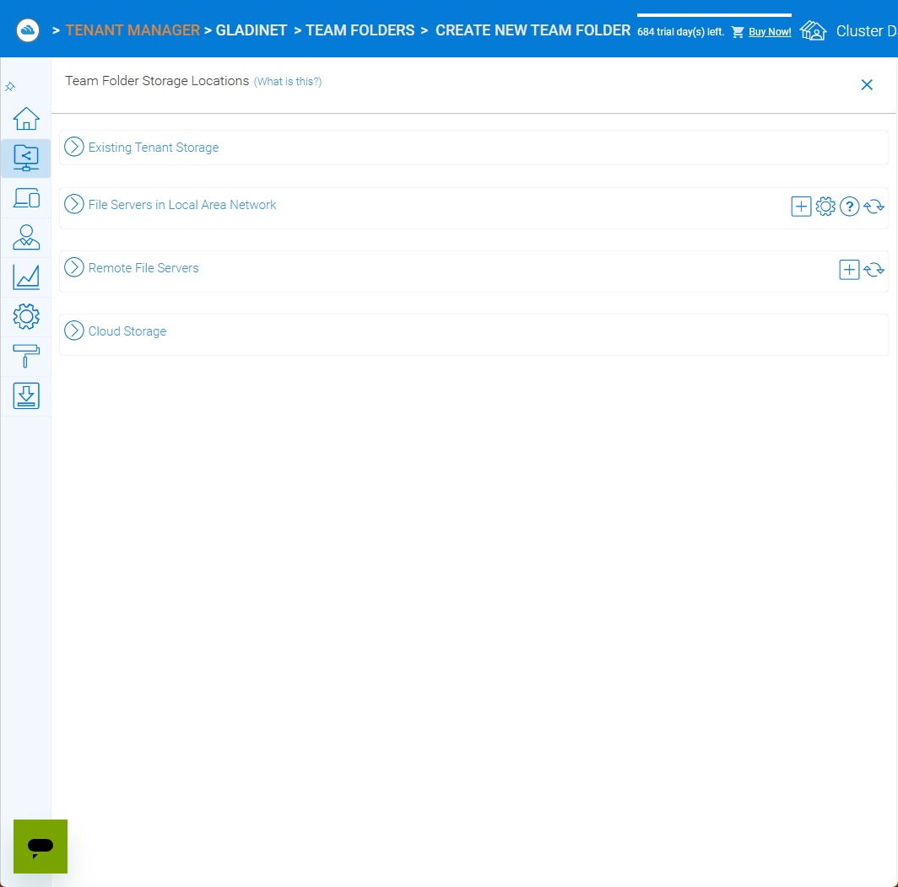

Cluster Administration
======================

This section describes cluster‑level administration tasks for CentreStack.  It is written for the master administrator (sometimes called **cluster administrator**, **server administrator** or **server farm administrator**) who controls the entire cluster/server farm.

.. note::
   In CentreStack's multi‑tenant architecture, the term *cluster* refers to the server farm that hosts all tenants.  The cluster administrator manages system‑wide settings, tenant provisioning, branding, reports, worker/web nodes and policies.

Introduction
------------

To access cluster administration features, sign in to the web portal as the cluster administrator.  The login URL is the DNS name or IP address of your CentreStack server.

After login, the **Cluster Dashboard** presents a summary of your environment.  It displays counts of tenants, users and assigned licences, the remaining trial days, and icons for navigation (Cluster Dashboard, Files, Settings, etc.).

.. image:: _static/cluster-admin-clicked-cluster-dashboard.png
   :alt: **Cluster Dashboard** page summarising counts of tenants, users and assigned licences, remaining trial days and navigation icons for Dashboard, Files and Settings

Tenant Manager
--------------

From the cluster dashboard, click the **Tenant Manager** tile to view and manage all tenants.  Each tenant card displays the tenant name, the tenant administrator, the number of users and storage usage.  A **New Tenant** tile allows you to create a tenant.

.. image:: _static/clicked-new-tenant-from-tenant-manager-screen.png
   :alt: highlights the **New Tenant** tile on the **Tenant Manager** screen.  Existing tenants are shown as cards while the highlighted tile has a large plus symbol and the label **New Tenant**

Tenant cards include a context menu with options:

* **Manage Tenant** – opens the tenant administration interface for that tenant.
* **Force full scan for storage quota usage** – recalculates storage usage for the tenant.
* **Change Tenant Admin Password** – reset the tenant administrator’s password.
* **Edit existing default storage** – change the storage location used by the tenant.
* **Delete Tenant** – remove the tenant.

.. image:: _static/tenant-manager-screen-right-clicked-3-bar-menu-on-a-tenant.png
   :alt: tenant card with its context menu expanded showing management options such as Manage Tenant, Force full scan, Change password, Edit storage and Delete tenant

Creating a New Tenant
---------------------

Click the **New Tenant** tile and choose **Add New Tenant** to start the wizard.  Provide the tenant name and admin email, then decide whether to create with default settings or customise storage and responsibilities.  The wizard guides you through:

1. Selecting whether to start from scratch or import existing data.
2. Setting the division of management between the cluster administrator and the tenant administrator.
3. Choosing a storage location: a sub‑folder of the cluster default tenant, an existing folder, or a new location.
4. Completing the tenant plan – specifying user licence count, storage quota and bandwidth limits.

.. image:: _static/clicked-new-tenant-from-tenant-manager-screen-screen3.png
   :alt: **Division of Responsibilities** page in the tenant creation wizard with radio buttons to choose whether the cluster admin or tenant admin manages users, storage, team folders and other resources

Cluster Branding
----------------

Under **Cluster Branding** you can customise the look and feel of the web portal and clients.

* **General** – set product name, choose a web UI theme, default language and custom URLs (home page, support, terms of use, privacy).
* **Web Portal** – upload logos (application icon, tenant logo, drive icon, login page logo), background images and choose colour themes.
* **Client Download** – control which client downloads appear on the login page; provide custom iOS/Android app URLs.
* **Windows Client** – configure application icon, drive icon, manufacturer name and contact info for the Windows client.
* **Mac Client** – configure icons for the macOS client (this may require an external branding task via partner account).
* **Emails** – customise email templates for user invitations, shared file notifications and system alerts.
* **Mobile Clients (Android/iOS)** – schedule branding tasks via your partner account.
* **Export/Import** – export current branding settings or import a branding string for reuse on other clusters.

.. image:: _static/cluster-dashboard-clicked-cluster-branding.png
   :alt: **General** tab of the Cluster Branding page with fields for Product Name, Web UI Theme, Default Language and custom URLs for Contact Us, Home Page, Terms of Use and Privacy Policy
.. image:: _static/cluster-dashboard-clicked-cluster-branding-then-web-portal-detail-view.png
   :alt: **Web Portal** tab of Cluster Branding showing upload slots for the Application Icon, Tenant Logo, Drive Icon, Login Page Logo, Background Image and Left Side Image

Reports
-------

Cluster reports provide visibility into usage and performance.

* **Upload Report** – graphs file uploads over the last 30 days, week, day and hour.
* **Storage Statistics** – summarises file counts and sizes, and lists top tenants and users by storage.
* **Active Users** – lists currently active sessions.
* **Guest Users** – lists active guest sessions.
* **Node Performance** – displays database statistics and per‑worker‑node performance metrics.
* **Bandwidth Usage** – graphs upload/download bandwidth and lists top tenants/users.
* **System Diagnostic Report** – runs a health check of your cluster (generates a diagnostic report).
* **Audit Trace** – search audit logs by user email and time range.

.. image:: _static/cluster-dashboard-clicked-reports-upload-report-view.png
   :alt: **Upload Report** page under Reports featuring graphs for file uploads over the last 30 days, week, day and hour

.. image:: _static/cluster-dashboard-clicked-bandwidth-usage-report.png
   :alt: **Bandwidth Usage** page displaying a line graph of upload/download bandwidth over time and tables listing top tenants and users by bandwidth

Cluster Controls
----------------

These controls manage cluster‑wide services and resources.

* **Cluster Admin** – add or remove additional cluster administrators and reset passwords.
* **Email Service** – configure SMTP settings for outbound email (host, port, credentials, encryption).
* **Application Manager** – integrate Microsoft Office Online Server or Zoho for online editing; provide the server address or API key and set the default viewer mode.
* **Client Version Manager** – manage the Windows client, Server Agent and macOS client versions available for download; upload new versions and set the default.
* **Settings** – contains several sub‑tabs described below.
* **Anti‑Virus** – select an antivirus engine for file scanning (set to **None** if scanning is not required).
* **Worker Nodes** – view and manage worker nodes; add or remove servers from the cluster.
* **Web Node** – manage web nodes that handle portal traffic.
* **Zones** – define geographic zones for multi‑region deployments and assign nodes to zones.

Cluster Settings
^^^^^^^^^^^^^^^^

Within **Settings** there are multiple tabs:

* **Cluster Settings** – toggles for login page features (hide build number, enable CAPTCHA, enable multi‑tenancy), purge policies, user avatars, file extension hiding, auto‑logon and other UI controls.
* **Performance & Throttling** – configure preview size limits and bandwidth limits per worker node.
* **Timeouts and Limits** – define session timeouts, token expiration, lock idle timeout, notification intervals, device limits and purge periods.
* **Languages** – enable or disable specific language packs and set the cluster default language.
* **Branding** – hide tutorial videos or enable tenant‑level branding.
* **Change Log** – set how many days to retain file change logs and specify email/database details for logging.
* **License String** – enter a licence key and view current licence status (user count, expiration and licensee).
* **Anti‑Virus** – choose the antivirus engine (None or integrated engine) for scanning uploaded files.

.. image:: _static/cluster-settings-screen1-cluster-settings.png
   :alt: **Cluster Settings** tab under Settings with toggle options to hide the build number, enable CAPTCHA, allow multi‑tenancy, purge storage after deletion, retrieve avatars from third‑party services and other controls
.. image:: _static/cluster-settings-screen3-timeouts-and-limits.png
   :alt: **Timeouts & Limits** tab under Settings where you set web session timeouts, native client token lifetimes, distributed lock idle timeout, notification intervals, device limits and purge periods

Default Group Policy
--------------------

The **Default Group Policy** defines baseline policies that apply to all tenants unless overridden by a tenant administrator.  Categories include:

* **Security** – options like notifying users when their email changes, re‑authenticating when the network changes, enabling Google sign‑in, impersonation for delegated admins and requiring file uploads through worker nodes.
* **Sharing** – require login to see files shared with me, disable external sharing of home directories, control internal share URLs, disable public links and show guest creation options and user lists in sharing dialogs.
* **File Locking & Collision** – settings for distributed locking, conflict resolution and file versioning.
* **Client Settings Manager** – manage client‑side features such as sync status indicators, startup behaviour and offline access.
* **Retention Policy & Ransomware Protection** – configure file retention periods and enable ransomware detection and quarantine.
* **Accounts & Login** – password policies, two‑factor authentication and SSO settings.
* **Folder & Storage** – control default storage types, enable versioning and attachments for files and folders.
* **Client Control** – limit client types, enforce client version updates and control other client behaviours.

.. image:: _static/cluster-policy-clicked-security-item-detail-view.png
   :alt: **Security** category of the Default Group Policy showing options such as notifying users when their email changes, re‑authenticating on network change, enabling Google sign‑in, allowing impersonation and forcing uploads/downloads through worker nodes
.. image:: _static/cluster-policy-clicked-sharing-detail-view.png
   :alt: **Sharing** category of the Default Group Policy with settings to require login for shared files, disable external sharing of home directories, enable internal share URLs, disable public links and control guest creation and user lists in share dialogs

These policies apply system‑wide.  Tenant administrators can override them on a per‑tenant basis, but the default group policy provides a sensible baseline for security and usability across the cluster.

Summary
-------

Cluster administration involves managing the overall system: provisioning tenants, configuring branding and system settings, monitoring usage through reports, maintaining worker and web nodes and applying global policies.  Each of these tasks is performed via the web portal when signed in as the cluster administrator.