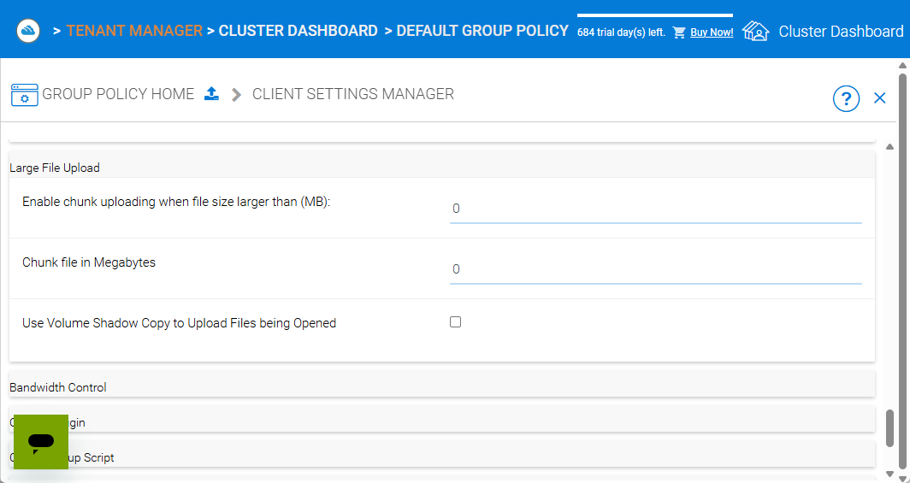
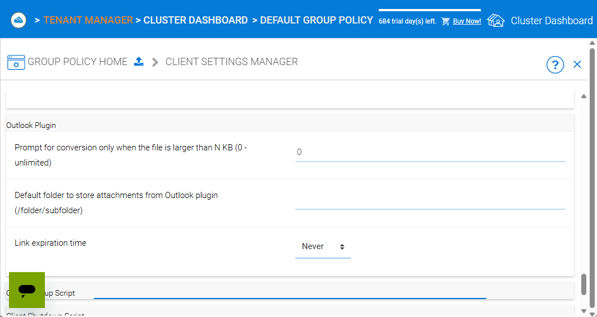
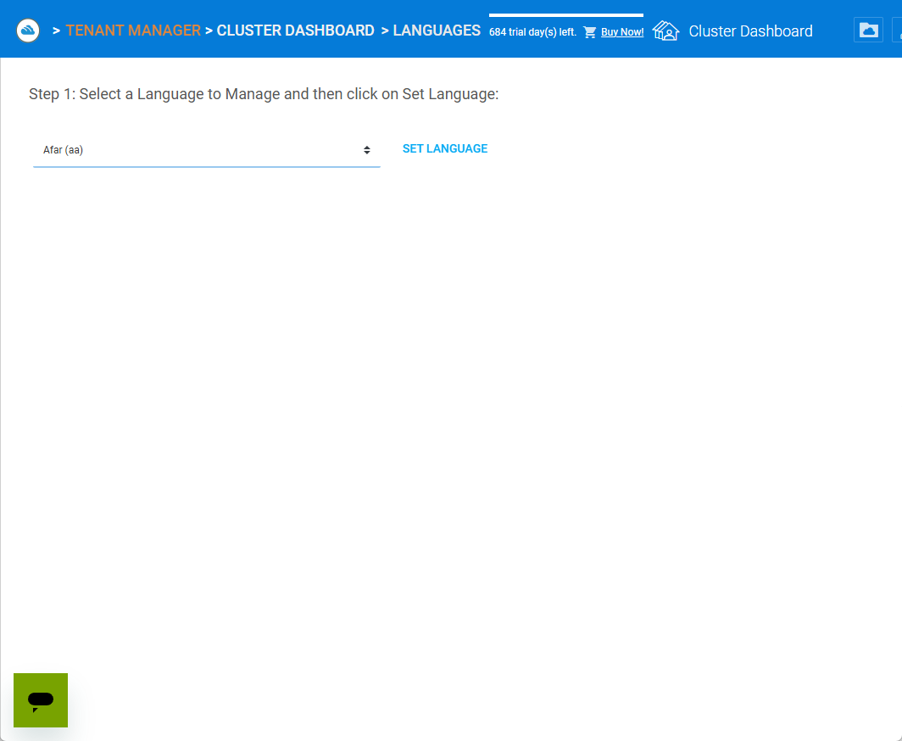

Cluster Administration
======================

This section describes cluster‑level administration tasks for CentreStack.  It is written for the master administrator (sometimes called **cluster administrator**, **server administrator** or **server farm administrator**) who controls the entire cluster/server farm.

.. note::
   In CentreStack's multi‑tenant architecture, the term *cluster* refers to the server farm that hosts all tenants.  The cluster administrator manages system‑wide settings, tenant provisioning, branding, reports, worker/web nodes and policies.

.. _cluster-admin-introduction:

Cluster Introduction
------------------------

To access cluster administration features, sign in to the web portal as the cluster administrator.  The login URL is the DNS name or IP address of your CentreStack server.

``http://localhost`` > ``Login Page``

.. image:: _static/centrestack-main-login-screen.png
   :alt: shows the CentreStack login screen with a **Sign In** title and fields for your email/username and password alongside a blue **Sign In** button

After login, the **Cluster Dashboard** presents a summary of your environment.  It displays counts of tenants, users and assigned licences, the remaining trial days, and icons for navigation (Cluster Dashboard, Files, Settings, etc.).

``Login Page`` > ``Cluster Dashboard``

Tenant Manager
--------------

From the cluster dashboard, click the **Tenant Manager** tile to view and manage all tenants.  Each tenant card displays the tenant name, the tenant administrator, the number of users and storage usage.  A **New Tenant** tile allows you to create a tenant.

``Cluster Dashboard`` > ``Tenant Manager``

Tenant cards include a context menu with options:

* **Manage Tenant** – opens the tenant administration interface for that tenant.
* **Force full scan for storage quota usage** – recalculates storage usage for the tenant.
* **Change Tenant Admin Password** – reset the tenant administrator’s password.
* **Edit existing default storage** – change the storage location used by the tenant.
* **Delete Tenant** – remove the tenant.

``Tenant Manager`` > ``Tenant Context Menu``

.. image:: _static/tenant-manager-screen-right-clicked-3-bar-menu-on-a-tenant.png
   :alt: tenant card with its context menu expanded showing management options such as Manage Tenant, Force full scan, Change password, Edit storage and Delete tenant

Creating a New Tenant
---------------------

Click the **New Tenant** tile and choose **Add New Tenant** to start the wizard.  Provide the tenant name and admin email, then decide whether to create with default settings or customise storage and responsibilities.  The wizard guides you through:

1. Selecting whether to start from scratch or import existing data.
2. Setting the division of management between the cluster administrator and the tenant administrator.
3. Choosing a storage location: a sub‑folder of the cluster default tenant, an existing folder, or a new location.
4. Completing the tenant plan – specifying user licence count, storage quota and bandwidth limits.

``Tenant Manager`` > ``New Tenant Wizard: Welcome``

.. image:: _static/clicked-new-tenant-from-tenant-manager-screen-screen2.png
   :alt: first page of the **Add New Tenant** wizard titled “Welcome” asking for tenant name and administrator email with options to start from scratch or import existing data
``Tenant Manager`` > ``New Tenant Wizard: Division of Responsibilities``

.. image:: _static/clicked-new-tenant-from-tenant-manager-screen-screen3.png
   :alt: **Division of Responsibilities** page in the tenant creation wizard with radio buttons to choose whether the cluster admin or tenant admin manages users, storage, team folders and other resources
``Tenant Manager`` > ``New Tenant Wizard: Storage Options``

.. image:: _static/tenant-scope-per-tenant-teamfolder-clicked-add-teamfolder-screen1.png
   :alt: **Storage Options** step of the tenant creation wizard showing radio buttons for Existing Tenant Storage, File Servers in LAN, Remote File Servers and Cloud Storage (S3/Azure/Wasabi)

Cluster Admins
--------------

The **Cluster Admins** link on the dashboard opens a page where you can view and manage the administrators of your CentreStack cluster.  Each administrator is listed with their email address and last login time, and you can add or remove cluster admins as needed.  Use this page to delegate administration tasks to other trusted users without granting them tenant‑level rights.

``Cluster Dashboard`` > ``Cluster Admins``

.. _cluster-admin-default-group-policy:

Cluster Default Group Policy
------------------------------

The **Default Group Policy** defines baseline policies that apply to all tenants unless overridden by a tenant administrator.  Categories include:

* **Security** – options like notifying users when their email changes, re‑authenticating when the network changes, enabling Google sign‑in, impersonation for delegated admins and requiring file uploads through worker nodes.
* **Sharing** – require login to see files shared with me, disable external sharing of home directories, control internal share URLs, disable public links and show guest creation options and user lists in sharing dialogs.
* **File Locking & Collision** – settings for distributed locking, conflict resolution and file versioning.
* **Client Settings Manager** – manage client‑side features such as sync status indicators, startup behaviour and offline access.
* **Retention Policy & Ransomware Protection** – configure file retention periods and enable ransomware detection and quarantine.
* **Accounts & Login** – password policies, two‑factor authentication and SSO settings.
* **Folder & Storage** – control default storage types, enable versioning and attachments for files and folders.
* **Client Control** – limit client types, enforce client version updates and control other client behaviours.

These policies apply system‑wide.  Tenant administrators can override them on a per‑tenant basis, but the default group policy provides a sensible baseline for security and usability across the cluster.

Overview
~~~~~~~~

At a glance, the Default Group Policy dashboard presents a tile for each policy area.  You can expand individual categories to adjust settings or review defaults.

``Cluster Dashboard`` > ``Default Group Policy`` > ``Overview``

zure AD, Home Directory, Folder & Storage, Attached Folder, Filters, Web Portal, Native Client and others

``Cluster Dashboard`` > ``Default Group Policy`` > ``Common Settings``

Client Control

Common Settings
~~~~~~~~~~~~~~~

The **Common Settings** group contains policies that apply to everyone.  These include Security, Sharing, File Locking, Client Settings Manager, Retention Policy & Ransomware Protection and Anti‑Virus/Ransomware.  Use these settings to define baseline security and collaboration rules for all tenants.

**Security** – control login re‑authentication, notifications when user details change and whether delegated admins can impersonate tenants.

``Cluster Dashboard`` > ``Default Group Policy`` > ``Security``

.. image:: _static/cluster-policy-clicked-security-item-detail-view.png
   :alt: Security settings page with toggles for email‑change notifications, re‑authentication on network change, Google sign‑in, impersonation and enforcing uploads/downloads through worker nodes

The **Security** page contains a handful of toggles that govern how users authenticate and how their sessions are protected.  Each option corresponds to a specific need an administrator might have.  For example:

* **Notify user when email is changed** – Notifies the original email address whenever the account email is changed, so that the user can detect unauthorised modifications and respond quickly.
* **Force client re‑authenticate when network changes** – Requires users to re‑login when their IP or network changes to reduce the risk of someone stealing a long‑lived session token for the client application.
* **Enable authenticating user with Google Apps credentials** – Allows users to sign in using their Google credentials for convenience and centralised identity management without requiring a separate password.
* **Delegate admin impersonates tenant admin via server agent** – When a delegated admin logs in via the Server Agent, automatically impersonates the tenant admin so the server agent synchronises with the main tenant’s default storage space instead of the delegate admin’s personal storage.
* **File upload and download go through worker node** – Forces all data transfers to pass through the worker node.  This is useful when object‑storage endpoints (such as Amazon S3) are blocked by company or country policy but the worker node’s IP (and the server farm) is permitted.
    * **Require multi‑factor authentication** – Mandates a second factor (such as a one‑time code or authenticator app) when users log in, dramatically increasing security by making stolen passwords insufficient on their own.
    * **Restrict external network access for native clients** – Prevents native clients from connecting over public or external networks; only devices on approved internal networks can access data, helping enforce perimeter security.

**Sharing** – govern public links and guest users.  Require recipients to log in, disable external sharing of home directories, enable internal share URLs, disable public links and show or hide guest creation options.

``Cluster Dashboard`` > ``Default Group Policy`` > ``Sharing``

.. image:: _static/cluster-policy-clicked-sharing-detailed-view-part1.png
   :alt: Sharing settings page with options to require login for shared files, disable external sharing of home directories, enable internal share URLs, disable public links and manage guest user options

The **Sharing** settings govern how users share files and folders with others.  They help administrators balance collaboration with security.  Key options include:

* **Require login for shared files** – Recipients must sign in to view shared items, ensuring that access is tracked and controlled.
* **Disable external sharing of home directories** – Prevents users from sharing their personal home folders externally to avoid inadvertent data exposure.
* **Enable internal share URLs** – Allows the system to generate share links using the worker node’s internal URL representation.  Many companies have separate internal and external DNS names for the same server, so an internal link avoids exposing external DNS names.
* **Disable public links** – Blocks creation of anonymous public links to ensure that all shares are authenticated.
* **Show or hide guest user options** – Determines whether share dialogs include options to invite guests, letting administrators restrict guest account creation.
* **Hide user and guest lists in sharing dialogs** – Conceals the lists of internal users and guests when creating shares, protecting privacy in organisations with large directories.
    * **Require approval for external guest accounts** – Enforces an administrator review process for guest invitations; external guests cannot access shared content until an admin approves the invitation.

**File Locking** – configure distributed locking rules.  Enable check‑in/check‑out, define automatic unlock time‑outs and allow forced unlocks.  The detailed view may span multiple screens.

``Cluster Dashboard`` > ``Default Group Policy`` > ``File Locking (Part 1)``

.. image:: _static/cluster-policy-clicked-file-locking-detailed-view-part1.png
   :alt: File Locking settings (part 1) showing options to enable locking rules, require check‑in/check‑out on all files, set lock expiration in minutes and specify the maximum number of simultaneous locks

``Cluster Dashboard`` > ``Default Group Policy`` > ``File Locking (Part 2)``

.. image:: _static/cluster-policy-clicked-file-locking-detailed-view-part2.png
   :alt: File Locking settings (part 2) continuing the options for lock time‑outs and user permissions

Use the **File Locking** pages to prevent conflicts when multiple users access the same file.  The controls allow you to:

* **Enable distributed file locking rules** – Turns on file locking across clients so that only one user can edit a file at a time.
* **Require check‑in/check‑out on all files** – Enforces a formal check‑in/check‑out workflow to prevent concurrent edits.
* **Lock expiration (minutes)** – Automatically releases locks after a specified number of minutes if the user forgets to unlock.
* **Max simultaneous locks** – Limits how many locks can be held at once to prevent a single user from monopolising files.
* **Allow forced unlocks** – Allows administrators or users with permission to override and release a lock when necessary.

**Client Settings Manager** – manage how native clients behave.  You can control bandwidth limits, large file upload chunking, mapped drive settings, Outlook plugin behaviour, scheduled sync windows and throttle rules.

``Cluster Dashboard`` > ``Default Group Policy`` > ``Client Settings Manager`` > ``Bandwidth Control``

.. image:: _static/cluster-policy-clicked-client-settings-manager-bandwidth-control-detail-view.png
   :alt: Bandwidth control settings for the client, including download/upload limits and number of file transfer threads

**Bandwidth Control** governs how much network capacity the client may use:

* **Download/upload limit (KB/s)** – Caps the bandwidth used by the client for downloads and uploads, preventing it from saturating the user's internet connection.
* **Number of threads** – Sets how many parallel transfers the client can perform, balancing speed with resource usage.
    * **Use Volume Shadow Copy to upload files being opened** – Utilises the Windows Volume Shadow Copy service to upload files that are currently open or locked by other applications, ensuring in‑use documents are backed up.

``Cluster Dashboard`` > ``Default Group Policy`` > ``Client Settings Manager`` > ``Large File Upload``

**Large File Upload** options improve reliability when uploading big files:

* **Enable chunked uploads** – Breaks large files into smaller chunks for reliable transfers and resumable uploads.
* **Chunk size** – Defines the size of each upload chunk.
* **Use Volume Shadow Copy** – Allows uploading files that are in use by temporarily copying them.
    * **Threshold file size (MB)** – Chunked uploading only applies to files larger than this size; a value of 0 means all files will be split into chunks.

``Cluster Dashboard`` > ``Default Group Policy`` > ``Client Settings Manager`` > ``Mapped Drive Control (Part 1)``

``Cluster Dashboard`` > ``Default Group Policy`` > ``Client Settings Manager`` > ``Mapped Drive Control (Part 2)``

.. image:: _static/cluster-policy-clicked-client-settings-manager-mapped-drive-control-detail-view-2.png
   :alt: Mapped Drive Control settings (part 2) covering drive letter assignment, cache size limits, purge schedules, offline mode, encryption of local cache, sync of folder metadata and other advanced options

**Mapped Drive Control** contains a long list of switches to customise how the native drive behaves on client machines:

* **Hide download tracker** – Hides the download status window for a cleaner user experience.
* **Disable folder move confirmation** – Removes prompts when users move folders within the mapped drive.
* **Allow file preview** – Lets users preview files directly from the cloud drive.
* **Hide storage quota** – Conceals quota information to simplify the interface.
* **Disable renaming root folders** – Prevents users from renaming top‑level directories.
* **Allow creating shortcuts** – Permits users to create shortcuts within the mapped drive.
* **Auto launch on login** – Automatically mounts the drive when the user logs in.
* **Suppress change notifications** – Hides notifications when files are added or modified.
* **Allow in‑place ZIP/EXE execution** – Enables opening archives and executables directly from the cloud drive.
* **Use Windows credentials** – Uses the Windows login credentials to authenticate to the drive for single sign‑on.
* **Maximum ZIP and thumbnail sizes** – Specifies the largest archive and image sizes for which previews are generated.
* **Drive letter** – Sets the letter assigned to the mapped drive.
* **Cache size limit** – Limits the amount of local disk space used for cached files.
* **Minimum free disk space** – Ensures that a certain amount of free space is left on the user's machine.
* **Purge logging DB after N days** – Automatically cleans the local database after a number of days.
* **Mount drive globally** – Makes the drive available to all users on the machine rather than per‑user.
* **Offline mode shows cached files only** – When offline, only displays files already cached locally.
* **Disable check out** – Prevents users from checking out files for editing.
* **Use default browser** – Forces links to open in the system default browser rather than the internal browser.
* **Encrypt local cache** – Encrypts cached files on disk for security.
* **Always sync folder metadata** – Ensures that folder names and structures are kept up to date even when content is not downloaded.
* **Disable AutoCAD optimisation** – Turns off special handling for AutoCAD files if not needed.

``Cluster Dashboard`` > ``Default Group Policy`` > ``Client Settings Manager`` > ``Outlook Plugin``

**Outlook Plugin** settings determine how email attachments are off‑loaded to the cloud:

* **File size threshold (KB)** – Above this size, attachments are converted to links to save email bandwidth and storage.
* **Default attachments folder** – Sets where attachments are stored in the cloud when off‑loaded from Outlook.
* **Link expiration (days)** – Determines how long the generated attachment links remain valid before expiring.

``Cluster Dashboard`` > ``Default Group Policy`` > ``Client Settings Manager`` > ``Schedule Sync``

.. image:: _static/cluster-policy-clicked-client-settings-manager-schedule-sync-detail-view.png
   :alt: Schedule Sync settings with a toggle to enable scheduled sync and fields to define start and end hours for paused sync windows

**Schedule Sync** lets administrators control when synchronisation occurs:

* **Enable scheduled sync** – Allows administrators to limit syncing to certain hours of the day.
* **Pause sync start hour** – Start time for the daily sync pause, during which no synchronisation occurs.
* **Pause sync end hour** – End time when synchronisation resumes.

``Cluster Dashboard`` > ``Default Group Policy`` > ``Client Settings Manager`` > ``Sync Throttle``

.. image:: _static/cluster-policy-clicked-client-settings-manager-sync-throttle-detail-view.png
   :alt: Sync Throttle settings allowing you to enable throttled uploads/downloads and specify the bandwidth limits and hours when throttling applies

**Sync Throttle** is used to moderate network usage outside normal hours:

* **Enable sync throttling** – Turns on throttled bandwidth for uploads and downloads.
* **Upload/download throttled speed (KB/s)** – Limits speeds during throttle times to conserve bandwidth.
* **Full‑speed start hour** – Time at which full‑speed sync begins.
* **Full‑speed stop hour** – Time at which full‑speed sync ends and throttling resumes.

``Cluster Dashboard`` > ``Default Group Policy`` > ``Client Settings Manager`` > ``macOS Client Settings``

.. image:: _static/cluster-policy-clicked-client-settings-mac-client-settings-detail-view.png
   :alt: macOS Client settings page with options to control behaviour specific to Mac clients

**macOS Client Settings** allow you to tailor the user experience on Apple computers:

* **Hide Mac sync status pop‑up** – Prevents pop‑up notifications about sync status on macOS.
* **Auto start Mac client** – Launches the Mac client automatically when the user logs in so that files are kept in sync.

**Retention Policy & Ransomware Protection** – define how long versioned files, deleted files and change logs are kept and enable ransomware detection.  You can specify retention periods for various log types, hide purge commands, suppress notifications and decide whether unpurged items count against storage quotas.

``Cluster Dashboard`` > ``Default Group Policy`` > ``Retention Policy``

.. image:: _static/cluster-policy-clicked-client-settings-retention-policy-detail-view.png
   :alt: Retention Policy settings with fields to specify retention periods for versions, deleted items, file change logs, audit traces and Mac client logs, plus options to hide purge commands and suppress notifications

The **Retention Policy** determines how long different types of data remain on the server before being purged:

* **Version retention (days)** – Number of days to keep old versions of files.
* **Deleted items retention (days)** – Days to keep deleted files before purging.
* **File change log retention (days)** – Days to retain change logs for audit or recovery.
* **Audit trace retention (days)** – Days to keep audit logs.
* **Mac client log retention (days)** – Days to store log files from the Mac client.
* **Hide purge commands** – Hides the purge option from users to prevent accidental deletion.
* **Suppress notifications** – Stops sending admin emails when items are purged.
* **Unpurged items count toward storage quotas** – Determines whether items in the retention period affect quota calculations.

``Cluster Dashboard`` > ``Default Group Policy`` > ``Anti Virus/Ransomware``

.. image:: _static/cluster-policy-clicked-client-settings-anti-virus-detail-view.png
   :alt: Anti Virus/Ransomware settings listing allowed and disallowed processes, file patterns to block, thresholds for disabling a device after excessive file changes and options to disable uploading files with specified prefixes, suffixes or substrings

**Anti‑Virus/Ransomware** controls protect your cluster from malicious software:

* **Allowed processes** – Processes permitted to update files on the cloud drive.
* **Blocked processes** – Programs that are denied from opening or modifying files in the cloud drive.
* **Device disable threshold** – Number of file changes in a short time that triggers disabling of the client device (ransomware detection).
* **Ignored processes** – Processes that the ransomware monitor will skip.
* **Block uploads by file name patterns** – Blocks uploading files if the name contains, starts with or ends with specified substrings, typically used to prevent uploading suspicious file types.

Accounts & Login
~~~~~~~~~~~~~~~~~

Policies under **Accounts & Login** focus on user identity and authentication, including password rules, user lifecycle settings, SSO integration and directory services.

**User Account** – configure how users are created and managed.  Options include enabling guest accounts, requiring password resets, restricting self‑registration, preventing users from renaming themselves, automatically deleting accounts when devices are removed and setting device limits.

``Cluster Dashboard`` > ``Default Group Policy`` > ``User Account (Part 1)``

``Cluster Dashboard`` > ``Default Group Policy`` > ``User Account (Part 2)``

.. image:: _static/cluster-policy-clicked-user-account-detail-view-2.png
   :alt: User Account settings (part 2) covering additional lifecycle options and device limits

**User Account** policies determine how users are created and managed:

* **Allow user self‑registration** – Lets users create their own accounts without admin approval.
* **Allow guest accounts** – Permits creation of guest accounts for external collaborators.
* **Force password reset on first login** – Requires users to change their password the first time they log in.
* **Prevent users from renaming themselves** – Stops users from changing their display name.
* **Auto‑delete account when device removed** – Automatically deletes a user account when their device is deregistered.
* **Device limit per user** – Sets the maximum number of devices a user can link to their account.

**Password Policy** – define minimum password length and complexity, expiration intervals and account lockout rules.

``Cluster Dashboard`` > ``Default Group Policy`` > ``Password Policy``

.. image:: _static/cluster-policy-clicked-password-policy-detail-view.png
   :alt: Password Policy settings with fields for minimum length, complexity requirements, expiration days, remembered password count and lockout thresholds

**Password Policy** enforces strong credentials:

* **Minimum password length** – Shorter passwords are easier to guess; setting a minimum length ensures stronger passwords.
* **Password complexity** – Requires a mix of uppercase, lowercase, numbers and special characters to make passwords harder to crack.
* **Password expiration (days)** – Forces users to change their password periodically to reduce the risk of long‑term compromise.
* **Number of remembered passwords** – Prevents users from reusing a set number of previous passwords.
* **Account lockout threshold** – Number of failed login attempts before the account is locked.
* **Lockout duration** – How long an account remains locked after exceeding the threshold.

**Single Sign‑On** – enable SAML or OpenID Connect integration.  Supply identity‑provider metadata, certificates and decide whether users can bypass SSO.

``Cluster Dashboard`` > ``Default Group Policy`` > ``Single Sign‑On``

.. image:: _static/cluster-policy-clicked-single-sign-on-detail-view.png
   :alt: Single Sign‑On settings with fields for IdP metadata URLs or certificates, button label text and toggles to require SSO for all users

**Single Sign‑On** simplifies authentication by delegating it to a corporate identity provider:

* **Enable SSO** – Uses SAML or OpenID Connect to authenticate users through an external identity provider.
* **Identity provider metadata** – Provides the URL or certificate information for the IdP.
* **SSO button label** – Text displayed on the login page for the SSO button.
* **Require SSO for all users** – Forces all users to use SSO; disables fallback to username/password.
* **Disable username/password login** – Prohibits local logins when SSO is enabled.

**Azure AD** – configure authentication via Azure Active Directory by entering your tenant ID and native application client ID.

``Cluster Dashboard`` > ``Default Group Policy`` > ``Azure AD``

**Azure AD** integration allows users to log in with Microsoft 365 credentials:

* **Enable Azure AD authentication** – Allows users to log in with their Azure AD credentials.
* **Tenant ID** – The Azure AD tenant identifier used to locate the directory.
* **Client ID** – The application ID registered in Azure AD for authentication.

Folder & Storage
~~~~~~~~~~~~~~~~

Policies in **Folder & Storage** determine where user and team folders reside and what file types are allowed.

**Folder & Storage** – configure paths for home and team folders, set storage quotas and decide whether tenant administrators can change these defaults.

``Cluster Dashboard`` > ``Default Group Policy`` > ``Folder & Storage``

.. image:: _static/cluster-policy-clicked-folder-and-storage-detail-view.png
   :alt: Folder & Storage settings page showing fields to define root paths for user home and team folders, set storage limits and enable or disable automatic folder creation

**Folder & Storage** settings determine where user and team folders reside and how much space each tenant can consume:

* **Home and team folder paths** – Sets root directories where user and team folders will be created.
* **Storage quotas** – Limits the total storage that a tenant can consume.
* **Auto‑create folders** – Automatically creates home or team folders upon user or tenant creation.
* **Restrict tenant admin changes** – Prevents tenant admins from modifying these storage settings.

**Home Directory** – set naming patterns for user home directories, choose whether to auto‑create them on first login and restrict users from changing their home location.

``Cluster Dashboard`` > ``Default Group Policy`` > ``Home Directory``

.. image:: _static/cluster-policy-clicked-home-directory-detail-view.png
   :alt: Home Directory settings page with options to specify naming patterns, automatically create home directories and restrict changes by users

**Home Directory** policies control how personal folders are provisioned:

* **Naming pattern** – Template for generating home directory names (e.g. `{user}@{tenant}`).
* **Auto‑create home directory** – Creates a user’s home directory the first time they log in.
* **Restrict changes** – Prevents users from changing their home directory path.
* **Auto‑add network shares** – Automatically connects network shares under the tenant root for convenience.

**Attached Folder** – control how client devices attach local folders and specific file types.  Options span multiple screens and include disabling attachment of local folders, enabling snapshot backup for server agent, allowing sync of empty or hidden files and managing allowed file extensions.

``Cluster Dashboard`` > ``Default Group Policy`` > ``Attached Folder (Part 1)``

``Cluster Dashboard`` > ``Default Group Policy`` > ``Attached Folder (Part 2)``

.. image:: _static/cluster-policy-clicked-attached-folder-detail-view-2.png
   :alt: Attached Folder settings (part 2) continuing the configuration with scheduled sync frequency options and impersonation controls

**Attached Folder** controls how client devices attach local folders and what file types are allowed:

* **Disable local folder attachment** – Prevents users from backing up or syncing local folders through the client.
* **Enable snapshot backup** – Allows server agent to create point‑in‑time backups of attached folders.
* **Sync empty files** – Includes zero‑byte files in backups and syncs.
* **Sync hidden files** – Includes hidden files (e.g. system files) in backups and syncs.
* **Allowed file extensions** – Specifies file types that can be attached or synced (e.g. `.exe`, `.iso`).
* **Scheduled sync frequency** – Sets how often attached folders are synced (e.g. daily, weekly).
* **Proxy mode** – Allows attachments to be synced through a proxy instead of a direct connection.
* **Impersonation** – Uses the logged‑in user's credentials to access attached folders.

**Filters** – define file types that are allowed or blocked when uploading or syncing data.

``Cluster Dashboard`` > ``Default Group Policy`` > ``Filters``

**Filters** let you explicitly allow or block certain file types:

* **Excluded file extensions** – List of extensions to block from being uploaded or synced.
* **Included file extensions** – List of extensions allowed, overriding the blocked list.
* **Import filter list** – Allows uploading a preconfigured list of file filters.
* **Export filter list** – Downloads the current list of file filters for backup or reuse.

**Web Portal** – configure portal‑specific policies such as UI behaviour and default landing pages.

``Cluster Dashboard`` > ``Default Group Policy`` > ``Web Portal (Part 1)``

.. image:: _static/cluster-policy-clicked-web-portal-detail-view-1.png
   :alt: Web Portal settings (part 1) showing configurable options for portal behaviour (example image placeholder)

``Cluster Dashboard`` > ``Default Group Policy`` > ``Web Portal (Part 2)``

.. image:: _static/cluster-policy-clicked-web-portal-detail-view-2.png
   :alt: Web Portal settings (part 2) with additional configuration options (example image placeholder)

The **Web Portal** page contains miscellaneous policies for the browser interface.  Use it to configure portal UI options such as default landing pages, navigation elements and branding fields.  Specific fields vary by release.

Client Control
~~~~~~~~~~~~~~

The **Client Control** category fine‑tunes how the CentreStack clients operate, including native and macOS clients.

**Native Client** – manage default behaviours for the Windows and macOS desktop clients.  Options cover auto‑start, tray visibility, caching, logging and whether users can change sync preferences.

``Cluster Dashboard`` > ``Default Group Policy`` > ``Native Client (Part 1)``

``Cluster Dashboard`` > ``Default Group Policy`` > ``Native Client (Part 2)``

.. image:: _static/cluster-policy-clicked-native-client-detail-view-2.png
   :alt: Native Client settings (part 2) continuing the client‑side configuration options (example image placeholder)

**Native Client** settings fine‑tune how the Windows desktop client behaves:

* **Auto start** – Launches the CentreStack client when the user logs in to ensure files stay synced.
* **Hide system tray icon** – Runs the client silently without showing a tray icon.
* **Disable offline caching** – Prevents local copies from being stored, improving security in high‑risk environments.
* **Encrypt local cache** – Encrypts cached files so that even if the device is compromised, the cached data remains protected.
* **Log level** – Sets the verbosity of client logs to aid in troubleshooting.
* **Restrict user settings** – Prevents end users from changing key client settings such as auto‑start or caching.

**Client Shutdown Script** – set commands to run when the client shuts down.

``Cluster Dashboard`` > ``Default Group Policy`` > ``Client Shutdown Script``

.. image:: _static/cluster-policy-clicked-client-settings-client-shutdown-script-detail-view.png
   :alt: Client Shutdown Script settings showing a field where administrators can specify a script that runs when the client closes

The **Client Shutdown Script** option lets administrators run a custom command when the Windows client closes.  For example, you might use this to run cleanup tasks, upload final logs or trigger a backup.

While this list summarises the major policy areas, each screen contains additional toggles and fields.  Explore the Default Group Policy pages to fine‑tune how your cluster operates.

Cluster Branding
----------------

Under **Cluster Branding** you can customise the look and feel of the web portal and clients.

* **General** – set product name, choose a web UI theme, default language and custom URLs (home page, support, terms of use, privacy).
* **Web Portal** – upload logos (application icon, tenant logo, drive icon, login page logo), background images and choose colour themes.
* **Client Download** – control which client downloads appear on the login page; provide custom iOS/Android app URLs.
* **Windows Client** – configure application icon, drive icon, manufacturer name and contact info for the Windows client.
* **Mac Client** – configure icons for the macOS client (this may require an external branding task via partner account).
* **Emails** – customise email templates for user invitations, shared file notifications and system alerts.
* **Mobile Clients (Android/iOS)** – schedule branding tasks via your partner account.
* **Export/Import** – export current branding settings or import a branding string for reuse on other clusters.

``Cluster Dashboard`` > ``Cluster Branding`` > ``General``

``Cluster Dashboard`` > ``Cluster Branding`` > ``Web Portal``

``Cluster Dashboard`` > ``Cluster Branding`` > ``Client Download``

.. image:: _static/cluster-dashboard-clicked-cluster-branding-then-client-download-detail-view.png
   :alt: **Client Download** tab of Cluster Branding with toggle buttons for each client type (Windows, Server Agent, macOS, iOS, Android) and fields for custom App Store and Play Store URLs

.. _cluster-admin-cluster-settings:

Cluster Settings Overview
--------------------------

Within **Cluster Settings** there are multiple tabs:

* **Cluster Settings** – toggles for login page features (hide build number, enable CAPTCHA, enable multi‑tenancy), purge policies, user avatars, file extension hiding, auto‑logon and other UI controls.
* **Performance & Throttling** – configure preview size limits and bandwidth limits per worker node.
* **Timeouts and Limits** – define session timeouts, token expiration, lock idle timeout, notification intervals, device limits and purge periods.
* **Languages** – enable or disable specific language packs and set the cluster default language.
* **Branding** – hide tutorial videos or enable tenant‑level branding.
* **Change Log** – set how many days to retain file change logs and specify email/database details for logging.
* **License String** – enter a licence key and view current licence status (user count, expiration and licensee).
* **Anti‑Virus** – choose the antivirus engine (None or integrated engine) for scanning uploaded files.

``Cluster Dashboard`` > ``Cluster Settings`` > ``Cluster Settings Tab``

``Cluster Dashboard`` > ``Cluster Settings`` > ``Timeouts & Limits``

.. image:: _static/cluster-settings-screen3-timeouts-and-limits.png
   :alt: **Timeouts & Limits** tab under Settings where you set web session timeouts, native client token lifetimes, distributed lock idle timeout, notification intervals, device limits and purge periods
``Cluster Dashboard`` > ``Cluster Settings`` > ``Languages``

.. image:: _static/cluster-settings-screen4-languages.png
   :alt: **Languages** tab under Settings showing a list of available languages such as Chinese, German, French, Italian and Dutch with a selector for the default cluster language

Application Manager
-------------------

The **Application Manager** integrates third‑party document viewers into CentreStack.  Two panels allow you to configure Microsoft Office Web App and Zoho Web App.  For each integration you supply the Office Online Server access point or Zoho API key and choose whether documents open in view‑only mode or use the selected service as the default viewer.  This feature enables seamless online editing and viewing of Office documents within the CentreStack portal.

``Cluster Dashboard`` > ``Application Manager``

.. _cluster-admin-languages:

Language Packs
---------------

CentreStack supports multiple language packs.  The **Languages** link displays a list of available languages (such as Chinese, German, French, Italian and Dutch) with toggles to enable or disable each pack.  You can also select a cluster‑wide default language.  Enabling language packs allows end‑users to switch the portal UI to their preferred language.

``Cluster Dashboard`` > ``Languages``

.. _cluster-admin-anti-virus:

Cluster Anti‑Virus
-------------------

Use the **Anti‑Virus** page to choose an antivirus engine for scanning files uploaded through worker nodes.  Setting the engine to **None** disables scanning, while selecting an integrated engine provides automatic virus scanning of uploaded files.  This setting protects your cluster from malicious content without requiring third‑party antivirus software.

``Cluster Dashboard`` > ``Anti‑Virus``

.. _cluster-admin-reports:

Cluster Reports
----------------

Cluster reports provide visibility into usage and performance.

* **Upload Report** – graphs file uploads over the last 30 days, week, day and hour.
* **Storage Statistics** – summarises file counts and sizes, and lists top tenants and users by storage.
* **Active Users** – lists currently active sessions.
* **Guest Users** – lists active guest sessions.
* **Node Performance** – displays database statistics and per‑worker‑node performance metrics.
* **Bandwidth Usage** – graphs upload/download bandwidth and lists top tenants/users.
* **System Diagnostic Report** – runs a health check of your cluster (generates a diagnostic report).
* **Audit Trace** – search audit logs by user email and time range.

``Cluster Dashboard`` > ``Reports`` > ``Upload Report``

``Cluster Dashboard`` > ``Reports`` > ``Storage Statistics``

.. image:: _static/cluster-dashboard-clicked-reports-and-then-storage-statistics-view.png
   :alt: **Storage Statistics** report listing totals for files, folders and storage size with pie charts of file types and tables ranking tenants and users by usage
``Cluster Dashboard`` > ``Reports`` > ``Bandwidth Usage``

.. image:: _static/cluster-dashboard-clicked-bandwidth-usage-report.png
   :alt: **Bandwidth Usage** page displaying a line graph of upload/download bandwidth over time and tables listing top tenants and users by bandwidth

Multi‑Tenancy Toggle
--------------------

At the bottom of the right‑hand panel on the Cluster Dashboard is a switch that toggles **Multi‑Tenancy** on or off.  When enabled, the cluster can host multiple isolated tenants.  Switching to single‑tenant mode restricts the environment to a single organisation.  Use this control when converting a test deployment into a production environment or when simplifying administration for a single organisation.

External DNS & Email Service
----------------------------

The **External DNS** link lets you configure the public DNS name or fully qualified domain name (FQDN) used by clients to access the CentreStack portal.  Clicking the edit icon opens a dialog where you enter the external URL.  Similarly, the **Email Service** page allows you to configure SMTP settings (host, port, credentials and encryption) for sending invitation emails, notifications and password resets.

``Cluster Dashboard`` > ``External DNS & Email Service`` > ``External DNS Dialog``

Worker Nodes
------------

Worker nodes perform file processing and handle background tasks for the cluster.  The **Worker Nodes** link lists all worker nodes, showing their status, role and assigned zones.  From this page you can add new nodes, remove offline nodes or assign nodes to geographic zones for multi‑region deployments.

``Cluster Dashboard`` > ``Worker Nodes``

.. image:: _static/cluster-dashboard-clicked-worker-node-to-node-list-view.png
   :alt: Worker Nodes list displaying each node with its status and actions to add or remove nodes or assign zones

Client Version Manager
----------------------

The **Client Version Manager** allows cluster administrators to publish and manage the versions of the CentreStack clients available for download.  Separate tabs let you configure the Windows client, Server Agent and macOS client.  For each client type you specify the version number and package path of the installer, set a daily upgrade limit, and define email lists for users who should or should not receive automatic upgrades.  When you publish a new version, existing clients will automatically update according to the configured schedule.

``Cluster Dashboard`` > ``Client Version Manager`` > ``Windows Client``

.. _cluster-admin-summary:

Cluster Administration Summary
-------------------------------

Cluster administration involves managing the overall system: provisioning tenants, configuring branding and system settings, monitoring usage through reports, maintaining worker and web nodes and applying global policies.  Each of these tasks is performed via the web portal when signed in as the cluster administrator.