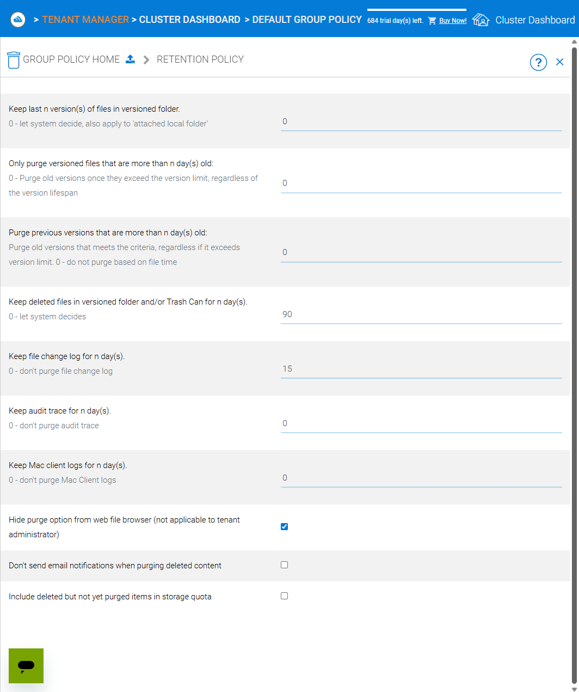
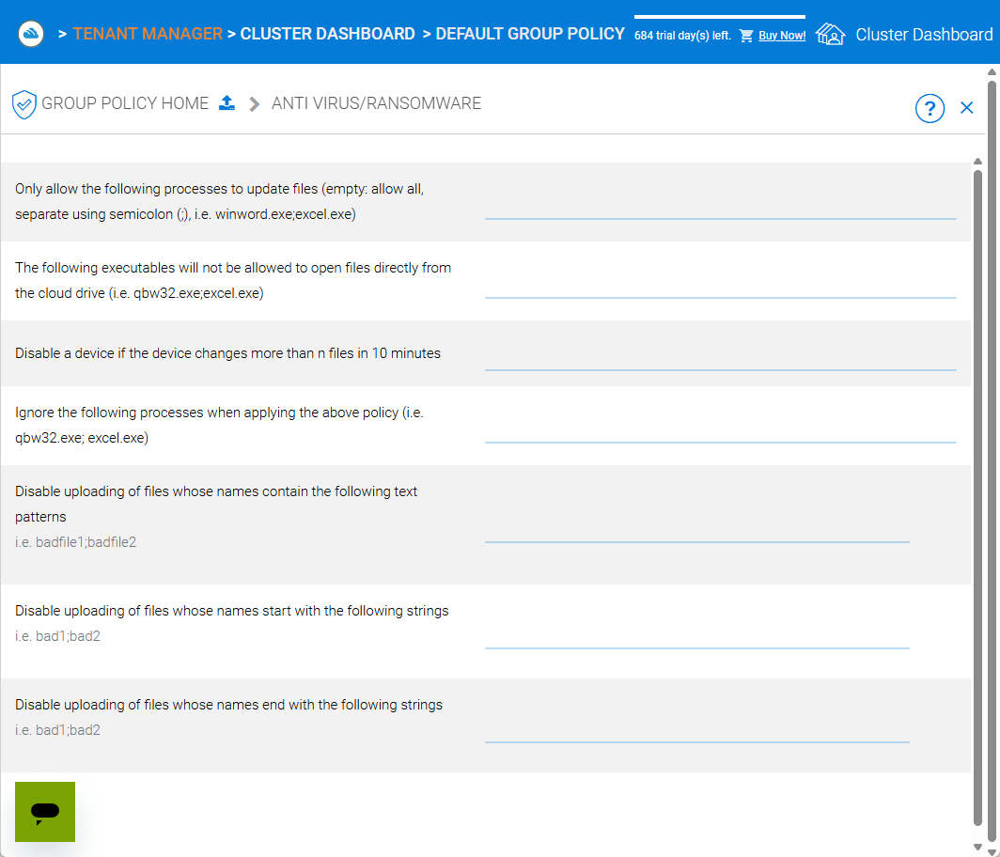

Cluster Administration
======================

This section describes cluster‑level administration tasks for CentreStack.  It is written for the master administrator (sometimes called **cluster administrator**, **server administrator** or **server farm administrator**) who controls the entire cluster/server farm.

.. note::
   In CentreStack's multi‑tenant architecture, the term *cluster* refers to the server farm that hosts all tenants.  The cluster administrator manages system‑wide settings, tenant provisioning, branding, reports, worker/web nodes and policies.

.. _cluster-admin-introduction:

Cluster Introduction
------------------------

To access cluster administration features, sign in to the web portal as the cluster administrator.  The login URL is the DNS name or IP address of your CentreStack server.

``http://localhost`` > ``Login Page``

.. image:: _static/centrestack-main-login-screen.png
   :alt: shows the CentreStack login screen with a **Sign In** title and fields for your email/username and password alongside a blue **Sign In** button

After login, the **Cluster Dashboard** presents a summary of your environment.  It displays counts of tenants, users and assigned licences, the remaining trial days, and icons for navigation (Cluster Dashboard, Files, Settings, etc.).

``Login Page`` > ``Cluster Dashboard``

.. image:: _static/cluster-admin-clicked-cluster-dashboard.png
   :alt: **Cluster Dashboard** page summarising counts of tenants, users and assigned licences, remaining trial days and navigation icons for Dashboard, Files and Settings

Tenant Manager
--------------

From the cluster dashboard, click the **Tenant Manager** tile to view and manage all tenants.  Each tenant card displays the tenant name, the tenant administrator, the number of users and storage usage.  A **New Tenant** tile allows you to create a tenant.

``Cluster Dashboard`` > ``Tenant Manager``

.. image:: _static/clicked-new-tenant-from-tenant-manager-screen.png
   :alt: highlights the **New Tenant** tile on the **Tenant Manager** screen.  Existing tenants are shown as cards while the highlighted tile has a large plus symbol and the label **New Tenant**

Tenant cards include a context menu with options:

* **Manage Tenant** – opens the tenant administration interface for that tenant.
* **Force full scan for storage quota usage** – recalculates storage usage for the tenant.
* **Change Tenant Admin Password** – reset the tenant administrator’s password.
* **Edit existing default storage** – change the storage location used by the tenant.
* **Delete Tenant** – remove the tenant.

``Tenant Manager`` > ``Tenant Context Menu``

.. image:: _static/tenant-manager-screen-right-clicked-3-bar-menu-on-a-tenant.png
   :alt: tenant card with its context menu expanded showing management options such as Manage Tenant, Force full scan, Change password, Edit storage and Delete tenant

Creating a New Tenant
---------------------

Click the **New Tenant** tile and choose **Add New Tenant** to start the wizard.  Provide the tenant name and admin email, then decide whether to create with default settings or customise storage and responsibilities.  The wizard guides you through:

1. Selecting whether to start from scratch or import existing data.
2. Setting the division of management between the cluster administrator and the tenant administrator.
3. Choosing a storage location: a sub‑folder of the cluster default tenant, an existing folder, or a new location.
4. Completing the tenant plan – specifying user licence count, storage quota and bandwidth limits.

``Tenant Manager`` > ``New Tenant Wizard: Welcome``

.. image:: _static/clicked-new-tenant-from-tenant-manager-screen-screen2.png
   :alt: first page of the **Add New Tenant** wizard titled “Welcome” asking for tenant name and administrator email with options to start from scratch or import existing data
``Tenant Manager`` > ``New Tenant Wizard: Division of Responsibilities``

``Tenant Manager`` > ``New Tenant Wizard: Storage Options``

.. image:: _static/tenant-scope-per-tenant-teamfolder-clicked-add-teamfolder-screen1.png
   :alt: **Storage Options** step of the tenant creation wizard showing radio buttons for Existing Tenant Storage, File Servers in LAN, Remote File Servers and Cloud Storage (S3/Azure/Wasabi)

Cluster Admins
--------------

The **Cluster Admins** link on the dashboard opens a page where you can view and manage the administrators of your CentreStack cluster.  Each administrator is listed with their email address and last login time, and you can add or remove cluster admins as needed.  Use this page to delegate administration tasks to other trusted users without granting them tenant‑level rights.

``Cluster Dashboard`` > ``Cluster Admins``

.. image:: _static/cluster-dashboard-clicked-cluster-admin.png
   :alt: Cluster Admins page listing existing administrators with options to add or remove admins

.. _cluster-admin-default-group-policy:

Cluster Default Group Policy
------------------------------

The **Default Group Policy** defines baseline policies that apply to all tenants unless overridden by a tenant administrator.  Categories include:

* **Security** – options like notifying users when their email changes, re‑authenticating when the network changes, enabling Google sign‑in, impersonation for delegated admins and requiring file uploads through worker nodes.
* **Sharing** – require login to see files shared with me, disable external sharing of home directories, control internal share URLs, disable public links and show guest creation options and user lists in sharing dialogs.
* **File Locking & Collision** – settings for distributed locking, conflict resolution and file versioning.
* **Client Settings Manager** – manage client‑side features such as sync status indicators, startup behaviour and offline access.
* **Retention Policy & Ransomware Protection** – configure file retention periods and enable ransomware detection and quarantine.
* **Accounts & Login** – password policies, two‑factor authentication and SSO settings.
* **Folder & Storage** – control default storage types, enable versioning and attachments for files and folders.
* **Client Control** – limit client types, enforce client version updates and control other client behaviours.

These policies apply system‑wide.  Tenant administrators can override them on a per‑tenant basis, but the default group policy provides a sensible baseline for security and usability across the cluster.

Overview
~~~~~~~~

At a glance, the Default Group Policy dashboard presents a tile for each policy area.  You can expand individual categories to adjust settings or review defaults.

``Cluster Dashboard`` > ``Default Group Policy`` > ``Overview``

.. image:: _static/cluster-dashboard-clicked-cluster-policy-all-policy-items-revealed-summary-view.png
   :alt: overview of all policy categories within the Default Group Policy dashboard, displaying colourful tiles for Security, Sharing, File Locking, Client Settings Manager, Retention Policy, Anti‑Virus/Ransomware, User Account, Password Policy, Single Sign‑On, Azure AD, Home Directory, Folder & Storage, Attached Folder, Filters, Web Portal, Native Client and others

``Cluster Dashboard`` > ``Default Group Policy`` > ``Common Settings``

.. image:: _static/cluster-dashboard-clicked-cluster-policy-common-setting-summary-view.png
   :alt: Common Settings summary view showing the first row of policy tiles (Security, Sharing, File Locking, Client Settings Manager, Retention Policy and Anti Virus/Ransomware) with the remaining categories collapsed under Accounts & Login, Folder & Storage and Client Control

Common Settings
~~~~~~~~~~~~~~~

The **Common Settings** group contains policies that apply to everyone.  These include Security, Sharing, File Locking, Client Settings Manager, Retention Policy & Ransomware Protection and Anti‑Virus/Ransomware.  Use these settings to define baseline security and collaboration rules for all tenants.

**Security** – control login re‑authentication, notifications when user details change and whether delegated admins can impersonate tenants.

``Cluster Dashboard`` > ``Default Group Policy`` > ``Security``

**Sharing** – govern public links and guest users.  Require recipients to log in, disable external sharing of home directories, enable internal share URLs, disable public links and show or hide guest creation options.

``Cluster Dashboard`` > ``Default Group Policy`` > ``Sharing``

**File Locking** – configure distributed locking rules.  Enable check‑in/check‑out, define automatic unlock time‑outs and allow forced unlocks.  The detailed view may span multiple screens.

``Cluster Dashboard`` > ``Default Group Policy`` > ``File Locking (Part 1)``

``Cluster Dashboard`` > ``Default Group Policy`` > ``File Locking (Part 2)``

**Client Settings Manager** – manage how native clients behave.  You can control bandwidth limits, large file upload chunking, mapped drive settings, Outlook plugin behaviour, scheduled sync windows and throttle rules.

``Cluster Dashboard`` > ``Default Group Policy`` > ``Client Settings Manager`` > ``Bandwidth Control``

``Cluster Dashboard`` > ``Default Group Policy`` > ``Client Settings Manager`` > ``Large File Upload``

.. image:: _static/cluster-policy-clicked-client-settings-manager-large-file-upload-detail-view.png
   :alt: Large File Upload settings allowing you to enable chunked uploads for files over a certain size, specify chunk size and enable volume shadow copy for open files

``Cluster Dashboard`` > ``Default Group Policy`` > ``Client Settings Manager`` > ``Mapped Drive Control (Part 1)``

.. image:: _static/cluster-policy-clicked-client-settings-manager-mapped-drive-control-detail-view-1.png
   :alt: Mapped Drive Control settings (part 1) with numerous checkboxes controlling client drive behaviour such as hiding the tracker, disabling folder move confirmations, allowing previews, setting max archive and thumbnail sizes and other client features

``Cluster Dashboard`` > ``Default Group Policy`` > ``Client Settings Manager`` > ``Mapped Drive Control (Part 2)``

``Cluster Dashboard`` > ``Default Group Policy`` > ``Client Settings Manager`` > ``Outlook Plugin``

.. image:: _static/cluster-policy-clicked-client-settings-manager-outlook-plugin-detail-view.png
   :alt: Outlook Plugin configuration showing a file size threshold for converting attachments to links, a default folder for storing attachments and a link expiration setting

``Cluster Dashboard`` > ``Default Group Policy`` > ``Client Settings Manager`` > ``Schedule Sync``

``Cluster Dashboard`` > ``Default Group Policy`` > ``Client Settings Manager`` > ``Sync Throttle``

``Cluster Dashboard`` > ``Default Group Policy`` > ``Client Settings Manager`` > ``macOS Client Settings``

.. image:: _static/cluster-policy-clicked-client-settings-mac-client-settings-detail-view.png
   :alt: macOS Client settings page with options to control behaviour specific to Mac clients

**Retention Policy & Ransomware Protection** – define how long versioned files, deleted files and change logs are kept and enable ransomware detection.  You can specify retention periods for various log types, hide purge commands, suppress notifications and decide whether unpurged items count against storage quotas.

``Cluster Dashboard`` > ``Default Group Policy`` > ``Retention Policy``

``Cluster Dashboard`` > ``Default Group Policy`` > ``Anti Virus/Ransomware``

Accounts & Login
~~~~~~~~~~~~~~~~~

Policies under **Accounts & Login** focus on user identity and authentication, including password rules, user lifecycle settings, SSO integration and directory services.

**User Account** – configure how users are created and managed.  Options include enabling guest accounts, requiring password resets, restricting self‑registration, preventing users from renaming themselves, automatically deleting accounts when devices are removed and setting device limits.

``Cluster Dashboard`` > ``Default Group Policy`` > ``User Account (Part 1)``

.. image:: _static/cluster-policy-clicked-user-account-detail-view-1.png
   :alt: User Account settings (part 1) showing options to allow user self‑registration, permit guest accounts, force password resets on first login and restrict users from renaming themselves

``Cluster Dashboard`` > ``Default Group Policy`` > ``User Account (Part 2)``

**Password Policy** – define minimum password length and complexity, expiration intervals and account lockout rules.

``Cluster Dashboard`` > ``Default Group Policy`` > ``Password Policy``

**Single Sign‑On** – enable SAML or OpenID Connect integration.  Supply identity‑provider metadata, certificates and decide whether users can bypass SSO.

``Cluster Dashboard`` > ``Default Group Policy`` > ``Single Sign‑On``

**Azure AD** – configure authentication via Azure Active Directory by entering your tenant ID and native application client ID.

``Cluster Dashboard`` > ``Default Group Policy`` > ``Azure AD``

.. image:: _static/cluster-policy-clicked-azure-ad-detail-view.png
   :alt: Azure AD settings page with check box to enable Azure AD authentication and fields for tenant ID and client ID

Folder & Storage
~~~~~~~~~~~~~~~~

Policies in **Folder & Storage** determine where user and team folders reside and what file types are allowed.

**Folder & Storage** – configure paths for home and team folders, set storage quotas and decide whether tenant administrators can change these defaults.

``Cluster Dashboard`` > ``Default Group Policy`` > ``Folder & Storage``

**Home Directory** – set naming patterns for user home directories, choose whether to auto‑create them on first login and restrict users from changing their home location.

``Cluster Dashboard`` > ``Default Group Policy`` > ``Home Directory``

**Attached Folder** – control how client devices attach local folders and specific file types.  Options span multiple screens and include disabling attachment of local folders, enabling snapshot backup for server agent, allowing sync of empty or hidden files and managing allowed file extensions.

``Cluster Dashboard`` > ``Default Group Policy`` > ``Attached Folder (Part 1)``

.. image:: _static/cluster-policy-clicked-attached-folder-detail-view-1.png
   :alt: Attached Folder settings (part 1) listing many toggles for disabling backup of local folders, enabling snapshot backup, syncing empty or hidden files and allowing specific file extensions (e.g. .exe, .iso, .bak, .vhd, .vmdk)

``Cluster Dashboard`` > ``Default Group Policy`` > ``Attached Folder (Part 2)``

**Filters** – define file types that are allowed or blocked when uploading or syncing data.

``Cluster Dashboard`` > ``Default Group Policy`` > ``Filters``

.. image:: _static/cluster-policy-clicked-filters-detail-view.png
   :alt: Filters settings page with lists of excluded and included file extensions and import/export buttons for filter lists

**Web Portal** – configure portal‑specific policies such as UI behaviour and default landing pages.

``Cluster Dashboard`` > ``Default Group Policy`` > ``Web Portal (Part 1)``

``Cluster Dashboard`` > ``Default Group Policy`` > ``Web Portal (Part 2)``

Client Control
~~~~~~~~~~~~~~

The **Client Control** category fine‑tunes how the CentreStack clients operate, including native and macOS clients.

**Native Client** – manage default behaviours for the Windows and macOS desktop clients.  Options cover auto‑start, tray visibility, caching, logging and whether users can change sync preferences.

``Cluster Dashboard`` > ``Default Group Policy`` > ``Native Client (Part 1)``

.. image:: _static/cluster-policy-clicked-native-client-detail-view-1.png
   :alt: Native Client settings (part 1) showing checkboxes for automatic start, hiding the system‑tray icon, disabling offline caching and controlling cache encryption and log verbosity

``Cluster Dashboard`` > ``Default Group Policy`` > ``Native Client (Part 2)``

**Client Shutdown Script** – set commands to run when the client shuts down.

``Cluster Dashboard`` > ``Default Group Policy`` > ``Client Shutdown Script``

While this list summarises the major policy areas, each screen contains additional toggles and fields.  Explore the Default Group Policy pages to fine‑tune how your cluster operates.

Cluster Branding
----------------

Under **Cluster Branding** you can customise the look and feel of the web portal and clients.

* **General** – set product name, choose a web UI theme, default language and custom URLs (home page, support, terms of use, privacy).
* **Web Portal** – upload logos (application icon, tenant logo, drive icon, login page logo), background images and choose colour themes.
* **Client Download** – control which client downloads appear on the login page; provide custom iOS/Android app URLs.
* **Windows Client** – configure application icon, drive icon, manufacturer name and contact info for the Windows client.
* **Mac Client** – configure icons for the macOS client (this may require an external branding task via partner account).
* **Emails** – customise email templates for user invitations, shared file notifications and system alerts.
* **Mobile Clients (Android/iOS)** – schedule branding tasks via your partner account.
* **Export/Import** – export current branding settings or import a branding string for reuse on other clusters.

``Cluster Dashboard`` > ``Cluster Branding`` > ``General``

.. image:: _static/cluster-dashboard-clicked-cluster-branding.png
   :alt: **General** tab of the Cluster Branding page with fields for Product Name, Web UI Theme, Default Language and custom URLs for Contact Us, Home Page, Terms of Use and Privacy Policy
``Cluster Dashboard`` > ``Cluster Branding`` > ``Web Portal``

.. image:: _static/cluster-dashboard-clicked-cluster-branding-then-web-portal-detail-view.png
   :alt: **Web Portal** tab of Cluster Branding showing upload slots for the Application Icon, Tenant Logo, Drive Icon, Login Page Logo, Background Image and Left Side Image
``Cluster Dashboard`` > ``Cluster Branding`` > ``Client Download``

.. image:: _static/cluster-dashboard-clicked-cluster-branding-then-client-download-detail-view.png
   :alt: **Client Download** tab of Cluster Branding with toggle buttons for each client type (Windows, Server Agent, macOS, iOS, Android) and fields for custom App Store and Play Store URLs

.. _cluster-admin-cluster-settings:

Cluster Settings Overview
--------------------------

Within **Cluster Settings** there are multiple tabs:

* **Cluster Settings** – toggles for login page features (hide build number, enable CAPTCHA, enable multi‑tenancy), purge policies, user avatars, file extension hiding, auto‑logon and other UI controls.
* **Performance & Throttling** – configure preview size limits and bandwidth limits per worker node.
* **Timeouts and Limits** – define session timeouts, token expiration, lock idle timeout, notification intervals, device limits and purge periods.
* **Languages** – enable or disable specific language packs and set the cluster default language.
* **Branding** – hide tutorial videos or enable tenant‑level branding.
* **Change Log** – set how many days to retain file change logs and specify email/database details for logging.
* **License String** – enter a licence key and view current licence status (user count, expiration and licensee).
* **Anti‑Virus** – choose the antivirus engine (None or integrated engine) for scanning uploaded files.

``Cluster Dashboard`` > ``Cluster Settings`` > ``Cluster Settings Tab``

.. image:: _static/cluster-settings-screen1-cluster-settings.png
   :alt: **Cluster Settings** tab under Settings with toggle options to hide the build number, enable CAPTCHA, allow multi‑tenancy, purge storage after deletion, retrieve avatars from third‑party services and other controls
``Cluster Dashboard`` > ``Cluster Settings`` > ``Timeouts & Limits``

``Cluster Dashboard`` > ``Cluster Settings`` > ``Languages``

.. image:: _static/cluster-settings-screen4-languages.png
   :alt: **Languages** tab under Settings showing a list of available languages such as Chinese, German, French, Italian and Dutch with a selector for the default cluster language

Application Manager
-------------------

The **Application Manager** integrates third‑party document viewers into CentreStack.  Two panels allow you to configure Microsoft Office Web App and Zoho Web App.  For each integration you supply the Office Online Server access point or Zoho API key and choose whether documents open in view‑only mode or use the selected service as the default viewer.  This feature enables seamless online editing and viewing of Office documents within the CentreStack portal.

``Cluster Dashboard`` > ``Application Manager``

.. image:: _static/cluster-dashboard-clicked-application-manager-view.png
   :alt: Application Manager page with panels for Microsoft Office Web App and Zoho Web App showing fields for server URL or API key and check boxes to set the default viewer

.. _cluster-admin-languages:

Language Packs
---------------

CentreStack supports multiple language packs.  The **Languages** link displays a list of available languages (such as Chinese, German, French, Italian and Dutch) with toggles to enable or disable each pack.  You can also select a cluster‑wide default language.  Enabling language packs allows end‑users to switch the portal UI to their preferred language.

``Cluster Dashboard`` > ``Languages``

.. image:: _static/cluster-dashboard-clicked-languages-view.png
   :alt: Languages page listing supported language packs with toggles to enable or disable each and a selector for the default language

.. _cluster-admin-anti-virus:

Cluster Anti‑Virus
-------------------

Use the **Anti‑Virus** page to choose an antivirus engine for scanning files uploaded through worker nodes.  Setting the engine to **None** disables scanning, while selecting an integrated engine provides automatic virus scanning of uploaded files.  This setting protects your cluster from malicious content without requiring third‑party antivirus software.

``Cluster Dashboard`` > ``Anti‑Virus``

.. image:: _static/cluster-dashboard-clicked-anti-virus-view.png
   :alt: Anti‑Virus settings page allowing administrators to select or disable the built‑in antivirus engine for file scanning

.. _cluster-admin-reports:

Cluster Reports
----------------

Cluster reports provide visibility into usage and performance.

* **Upload Report** – graphs file uploads over the last 30 days, week, day and hour.
* **Storage Statistics** – summarises file counts and sizes, and lists top tenants and users by storage.
* **Active Users** – lists currently active sessions.
* **Guest Users** – lists active guest sessions.
* **Node Performance** – displays database statistics and per‑worker‑node performance metrics.
* **Bandwidth Usage** – graphs upload/download bandwidth and lists top tenants/users.
* **System Diagnostic Report** – runs a health check of your cluster (generates a diagnostic report).
* **Audit Trace** – search audit logs by user email and time range.

``Cluster Dashboard`` > ``Reports`` > ``Upload Report``

.. image:: _static/cluster-dashboard-clicked-reports-upload-report-view.png
   :alt: **Upload Report** page under Reports featuring graphs for file uploads over the last 30 days, week, day and hour
``Cluster Dashboard`` > ``Reports`` > ``Storage Statistics``

.. image:: _static/cluster-dashboard-clicked-reports-and-then-storage-statistics-view.png
   :alt: **Storage Statistics** report listing totals for files, folders and storage size with pie charts of file types and tables ranking tenants and users by usage
``Cluster Dashboard`` > ``Reports`` > ``Bandwidth Usage``

Multi‑Tenancy Toggle
--------------------

At the bottom of the right‑hand panel on the Cluster Dashboard is a switch that toggles **Multi‑Tenancy** on or off.  When enabled, the cluster can host multiple isolated tenants.  Switching to single‑tenant mode restricts the environment to a single organisation.  Use this control when converting a test deployment into a production environment or when simplifying administration for a single organisation.

External DNS & Email Service
----------------------------

The **External DNS** link lets you configure the public DNS name or fully qualified domain name (FQDN) used by clients to access the CentreStack portal.  Clicking the edit icon opens a dialog where you enter the external URL.  Similarly, the **Email Service** page allows you to configure SMTP settings (host, port, credentials and encryption) for sending invitation emails, notifications and password resets.

``Cluster Dashboard`` > ``External DNS & Email Service`` > ``External DNS Dialog``

.. image:: _static/cluster-dashboard-clicked-external-dns-edit-icon-to-edit-exernal-url-dialog-view.png
   :alt: External DNS configuration dialog with fields to specify the cluster’s public URL

Worker Nodes
------------

Worker nodes perform file processing and handle background tasks for the cluster.  The **Worker Nodes** link lists all worker nodes, showing their status, role and assigned zones.  From this page you can add new nodes, remove offline nodes or assign nodes to geographic zones for multi‑region deployments.

``Cluster Dashboard`` > ``Worker Nodes``

Client Version Manager
----------------------

The **Client Version Manager** allows cluster administrators to publish and manage the versions of the CentreStack clients available for download.  Separate tabs let you configure the Windows client, Server Agent and macOS client.  For each client type you specify the version number and package path of the installer, set a daily upgrade limit, and define email lists for users who should or should not receive automatic upgrades.  When you publish a new version, existing clients will automatically update according to the configured schedule.

``Cluster Dashboard`` > ``Client Version Manager`` > ``Windows Client``

.. image:: _static/cluster-dashboard-clicked-windows-client-to-get-to-client-version-manager.png
   :alt: Client Version Manager displaying the Windows client tab with fields for version number, package path, daily upgrade limit and user lists, plus a publish link to push updates

.. _cluster-admin-summary:

Cluster Administration Summary
-------------------------------

Cluster administration involves managing the overall system: provisioning tenants, configuring branding and system settings, monitoring usage through reports, maintaining worker and web nodes and applying global policies.  Each of these tasks is performed via the web portal when signed in as the cluster administrator.