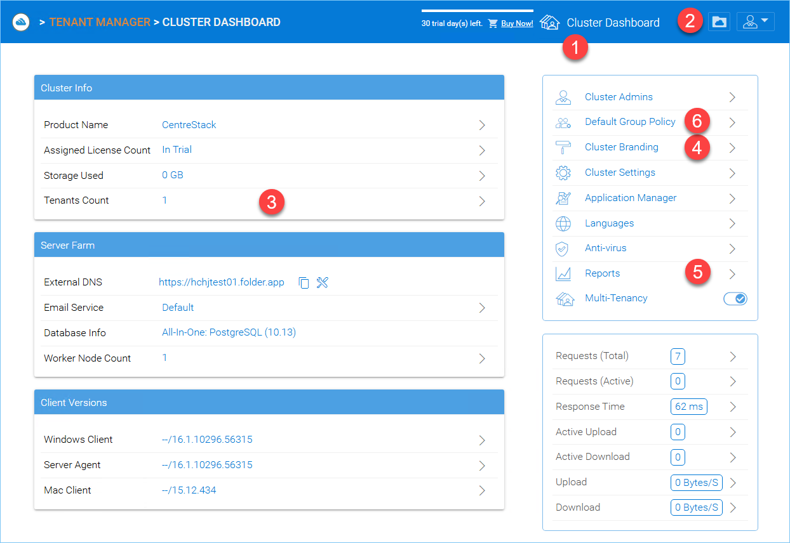

Getting Started
===============

This section provides an introduction to CentreStack administration, including setup and initial configuration tasks.

Introduction
------------

Welcome to the CentreStack Administration Guide. CentreStack is a mobile access and secure file‑sharing solution that focuses on local file server cloud‑enablement. It runs on Microsoft Windows Server and includes client agents for Windows, Mac OS X, web browsers and mobile devices (Android and iOS).

.. important::

   CentreStack includes a client application for Windows File Server called **Server Agent**. This document covers CentreStack itself and does not cover the *Server Agent*.

.. attention::

   This admin guide is written for CentreStack version 16.6.10352.56511. Future releases may introduce new features and changes.

Overview
--------

CentreStack differentiates itself from other file sync and share solutions by focusing on data security, permission controls and hybrid file server mobilization. Key capabilities include:

- **Maintaining NTFS and Active Directory permissions** – user permissions and security inherit from your existing file servers.
- **Live sync and versioning** – files are synchronized in real time with version control and revision history.
- **On‑demand access** – users access files directly from the server in real time; read‑only and write permissions are honoured on demand.
- **Mirroring network shares** – existing network shares can be published as team folders for collaboration without migration.
- **Drive mapping & file locking** – the Windows client provides a mapped drive with file locking, version control and offline caching.

Interface Overview
------------------

After signing in, administrators land on the **Cluster Dashboard**, which shows the cluster status and provides quick access to common tasks. The screenshot below highlights the major components.

Installation and Setup
-----------------------

This guide assumes that you have access to a Windows Server environment. To install the CentreStack server software:

1. Ensure prerequisites are met: a supported Windows Server edition, IIS, .NET Framework 4.8 or later, and a SQL database (either SQL Server or MySQL).
2. Download the CentreStack installer and run it on the server.
3. Follow the setup wizard to install the server components.
4. When prompted, configure the database connection (SQL Server or MySQL) and create or connect to an existing database.
5. Specify the hostname and port for the web portal.
6. Create the cluster administrator account with a strong password.
7. Complete the installation and sign in to the web portal using the cluster admin credentials.

Initial Configuration
---------------------

After installation, perform the following tasks to set up your first tenant and users:

1. Navigate to **Tenant Manager** and click **New Tenant**.
2. Enter a name, administrator email, plan and storage settings, then proceed to create the tenant.
3. In the newly created tenant, go to **Team Folders** and attach existing file server folders or cloud storage as team folders.
4. Invite users and groups to the tenant. You can create native users or import users and groups from Active Directory.
5. Test end‑user access using the web portal and native clients to ensure the configuration works as expected.
