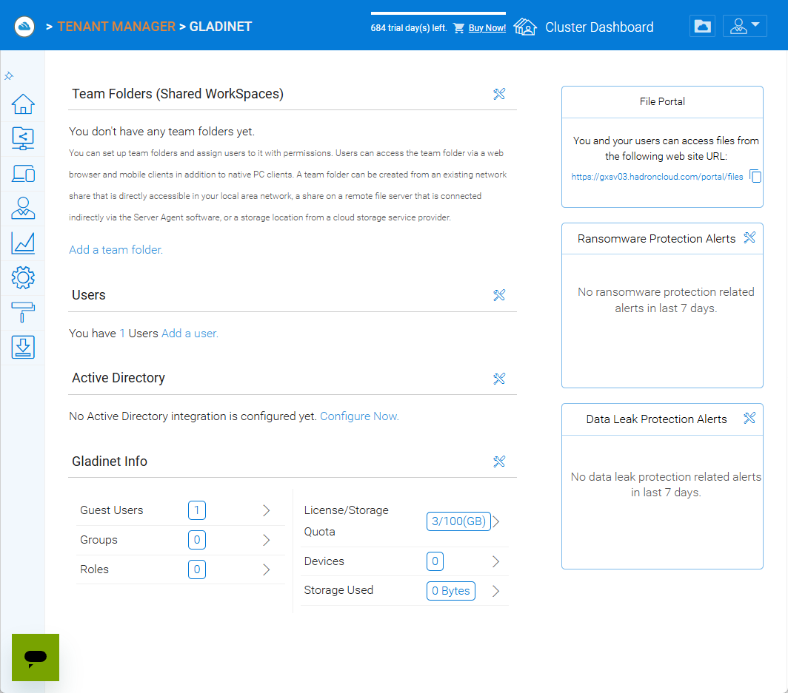

Tenant Administration
=====================

This section describes administration tasks performed at the tenant level.  A tenant typically represents an organisation or department.  Tenant administrators have full control over their own users, storage and policies but cannot affect other tenants.

.. _tenant-admin-dashboard:

Dashboard
---------

You can access the tenant administration interface either by signing in as the tenant administrator or by clicking **Manage Tenant** from the cluster administrator’s Tenant Manager.  The tenant dashboard summarises usage and provides quick links to Team Folders, Devices, Users, Reports and Settings.

Team Folders
------------

Team folders are shared workspaces similar to network shares.  From the **Team Folders** page you can:

* **Create a new team folder** by clicking **Add New Team Folder** (+).  A wizard allows you to choose the underlying storage: existing tenant storage, local file server shares via server agent, remote file servers or cloud storage (S3, Azure Blob, Wasabi, etc.).
* **Manage an existing team folder** by clicking the **Edit** icon.  Here you can adjust folder information, collaborators, external sharing, access policies, folder permissions and folder settings.

.. image:: _static/tenant-scope-per-tenant-teamfolder-clicked-add-teamfolder-screen1.png
   :alt: **Add New Team Folder** wizard step where you choose the underlying storage from Existing Tenant Storage, File Servers in LAN, Remote File Servers or Cloud Storage (S3/Azure/Wasabi)

Devices
-------

The **Devices** page lists devices connected by tenant users (desktops, mobiles and other clients).  You can disable, wipe or rename devices from this page.

Users
-----

Under **Users & Groups** you can manage users, groups and roles:

* **Users** – create regular users or guest accounts, reset passwords and assign roles.
* **Groups** – create groups to simplify assignment of team folder permissions.
* **Roles** – define custom roles with specific rights and assign them to users.

Reports
-------

Tenant administrators can run reports scoped to their tenant:

* **Upload Report** – track file uploads over time.
* **Storage Statistics** – view total files, folders and storage by type.
* **Bandwidth Usage** – see upload/download bandwidth and top users.
* **Team Folders** – statistics per team folder.
* **Shared Objects** – list shared files and folders.
* **Audit Trace** – search audit logs for actions within the tenant.
* **File Change Log** – view historical changes to files.
* **Folder Permissions** – report on permissions for each folder.
* **Distributed Locks** – monitor locked files.
* **Pending Purged Folder** – view items scheduled for purge.

.. image:: _static/tenant-scope-per-tenant-report-view.png
   :alt: tenant‑level **Storage Statistics** report summarising files, folders and storage usage with pie charts and tables ranking team folders or users by usage
.. image:: _static/tenant-scope-per-tenant-report-view.png
   :alt: tenant‑level **Upload Report** with graphs depicting file uploads over the last month, week, day and hour for this tenant
.. image:: _static/tenant-scope-per-tenant-report-view.png
   :alt: **Shared Objects** report listing files and folders shared by users in the tenant with details such as path, share type and expiry date

Settings
--------

The **Settings** section includes many sub‑pages where you configure integrations, policies and client behaviours:

* **Active Directory** – integrate with local or external Active Directory; configure AD server settings, user provisioning and attribute mapping.
* **Single Sign‑On (SAML Integration)** – configure SAML SSO with your identity provider by supplying IdP metadata and certificates.
* **File Locking** – enable distributed file locking and set conflict resolution policies.
* **Notifications** – configure email notifications for events such as folder changes, sync task failures and upload/download completion.
* **User Account & Security** – manage tenant administrators, user accounts, password policies, access controls, security settings (e.g., allow cluster admin to manage my tenant) and the default home directory.
* **Ransomware Protection** – enable ransomware detection and quarantine settings.
* **Data Leak Protection** – set sharing policies (require login for shared items, disable public links), configure guest user restrictions and enable watermarking.
* **Clients & Applications** – configure client settings (UI features, offline access), web portal settings and native client settings.
* **Folder & Storage** – manage backend storage (connect to file servers, remote file servers or cloud storage), configure retention policies and attach additional storage.
* **Background Tasks & Filters** – view background tasks (e.g., indexing) and configure file type filters.

Branding
--------

The **Branding** page allows tenant administrators to customise the look and feel of their tenant portal independent of the cluster branding.  You can upload a custom tenant logo, choose a colour theme and set a background image for the login page.

Client Downloads
---------------

The **Client Downloads** page lists the client software available for your tenant.  It provides download links for the latest Windows client, Server Agent and macOS client, along with links to the iOS App Store and Google Play for mobile apps.  Use this page to ensure your users are running the most recent client versions.

Tenant Administration Summary
----------------------------

Tenant administration focuses on managing a single organisation’s users, storage and policies.  Tenant administrators have many of the same capabilities as cluster administrators, but only within their own tenant.  They can create and manage team folders, integrate with Active Directory and SAML SSO, enforce security and data protection policies, customise their branding and client download options, and monitor usage through detailed reports.